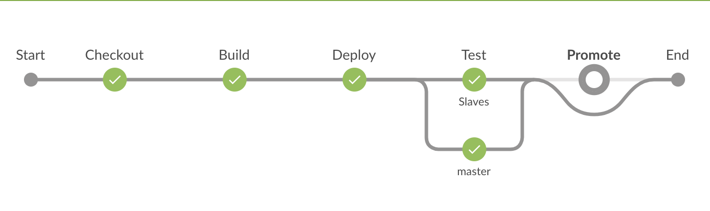
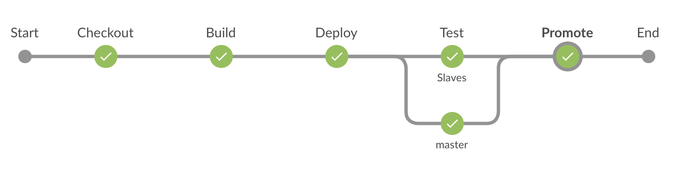

# Jenkins docker images repository

This repository contains jenkins docker images to run on openshift.
This has been tested on an Openshift cluster and it initially is based on official Openshift jenkins based image.
Currently, it supports `Centos` and `Rhel` based images.

Compare to the official [Openshift images](https://github.com/openshift/jenkins), these images does not use [Software Collections](https://developers.redhat.com/products/softwarecollections/overview/).
It gives us the flexibility to combine jenkins agent images to the same pod template like it is done in [jenkins agent gradle nodejs](./agent-gradle-nodejs/README.md).
See [this issue](https://github.com/openshift/jenkins/issues/582) for more details about this topic.

It has also the intent to use latest tools that are not yet supported by RedHat.

## Setup With Helm (recommended)

[Helm](https://docs.helm.sh) (aka The package manager for Kubernetes) is the recommended way to setup the `cicd` infrastructure and so `jenkins`.
To install `helm cli` and `tiller` on `Openshift`, please follow the guideline [here](https://github.com/arnaud-deprez/cicd-openshift/blob/master/README.md).

Once it is done, you can run the following: 

```sh
namespace=cicd
oc new-project $namespace
# install objects
helm upgrade --install --set fullnameOverride=jenkins --set Master.HostName="<ingress_hostname>" jenkins charts/jenkins-openshift
# trigger builds
oc start-build jenkins-openshift-docker
oc start-build jenkins-agent-base
```

---
**NOTE:**
> To avoid openshift to auto provision the default jenkins, you must a service called `jenkins`.
> That's why we use `fullnameOverride` property.
> More information here https://docs.openshift.org/latest/install_config/configuring_pipeline_execution.html
---

For example, with `minishift` you can setup the hostname with:

```sh
# centos images
helm upgrade --install --set fullnameOverride=jenkins --set Master.HostName="jenkins-cicd.$(minishift ip).nip.io" jenkins charts/jenkins-openshift
# rhel images
helm upgrade --install --set fullnameOverride=jenkins --set Master.HostName="jenkins-cicd.$(minishift ip).nip.io" --set Deployment.OS=rhel jenkins charts/jenkins-openshift
# trigger builds
oc start-build jenkins-openshift-docker
oc start-build jenkins-agent-base
```

## Setup with Openshift Templates

### Jenkins master

The jenkins master image is based on the official [openshift/jenkins](https://github.com/openshift/jenkins) image.
For more information and how to run it in Openshift, follow [this guide](2/README.md).

### Jenkins slave images

Here is the current list of images for the jenkins slaves (follow the links to see how to use it):

* [jenkins-agent-base](agent-base/README.md)
* [jenkins-agent-gradle](agent-gradle/README.md)
* [jenkins-agent-nodejs](agent-nodejs/README.md)
* [jenkins-agent-gradle-nodejs](agent-gradle-nodejs/README.md)

## Setup through Jenkins pipeline self promotion

If you have successfully followed the guides above, you probably realise that it's a lot of manual interventions.
While this is completely fine to quickly bootstrap a CI/CD infrastructure for testing or so, in real life, this infrastructure will probably evolve a lot.
For example: you will upgrade plugins, install new one, add/update configuration and add/update slaves.

Probably in your company, you will have some people that will take of it and normally, they would like to validate their changes in an isolated environment before promoting it to the developers so you can minimize the impact on the application pipelines, the same way as you test your applications before promoting it to production.

In this scenario, we will see how we can use Jenkins and its pipeline to promote a new CI/CD infrastructure with the changes we have made and tested.

### Build and deploy pipeline



Here are the steps:

* When it runs a job, it builds docker images for jenkins master and its slave from the jenkins deployed in `cicd` environment.
* Then if the builds succeed, it deploys the new jenkins master and its slaves in `cicd-staging` environment and then it will run a test pipeline against it to ensure that we didn't break anything. It will also apply the changes on `jenkins-promote-pipeline` job if needed.
* Finally, if it builds the `master` branch, it will trigger the job `jenkins-promote-pipeline` in the jenkins instance from the `cicd-staging` environment with `BRANCH_NAME=master` as parameter.



### Promote pipeline


Here are the steps:

* Checkout https://github.com/arnaud-deprez/jenkins-docker-openshift.git at `BRANCH_NAME` parameter.
* This pipeline promotes this new jenkins version with its slaves into `cicd` environment. The promotion consist of tagging the image from `cicd-staging` to `cicd` and apply the changes in the various configurations.

### Setup jenkins to allow self promotion

```sh
oc new-project cicd
oc process -f 2/openshift/jenkins-ephemeral-template.yml | oc apply -n cicd -f -
oc adm policy add-cluster-role-to-user self-provisioner -z jenkins -n cicd
```

While waiting for the [Multibranch pipeline support in BuildConfig](https://github.com/openshift/jenkins-sync-plugin/issues/190), you just need to configure a multi-branch pipeline pointing to the git repository https://github.com/arnaud-deprez/jenkins-docker-openshift.git (or to your own repository) in that temporary jenkins instance.