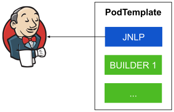
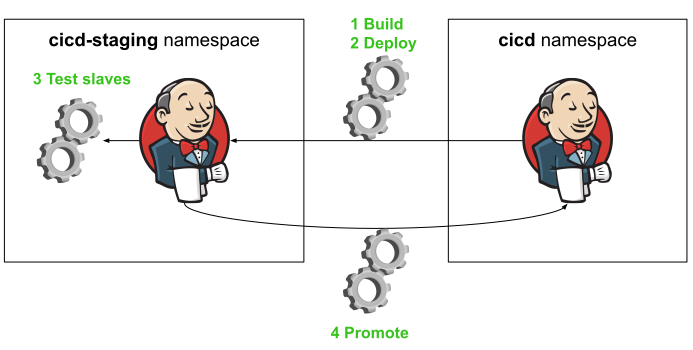
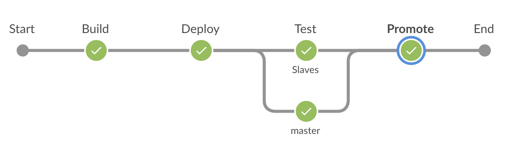
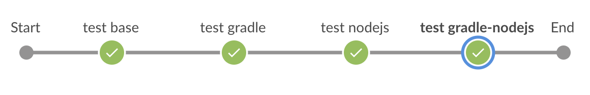

# Jenkins docker images repository [](https://travis-ci.org/arnaud-deprez/jenkins-docker-openshift)

This repository contains jenkins docker images to run on Openshift but it should also be runnable on any vanilla Kubernetes environment.
This has been tested on an Openshift cluster and it is based on official Openshift jenkins based image.

There are however some slight differences between this setup and the [default Openshift setup](https://github.com/openshift/jenkins) setup:

1. These images doe not use [Software Collections](https://developers.redhat.com/products/softwarecollections/overview/).
It gives us the flexibility to combine jenkins builder images to the same Pod template.
See [this issue](https://github.com/openshift/jenkins/issues/582) for more details.
1. The `builder images` does not contain the `jnlp client` to manage the communication with the master.
Instead, each Pod template is composed of 1 [jnlp](./jnlp) container and one or more `builder` container(s).
I've found that this setup better isolates the configuration - especially if we use a `java builder` such as [builder-gradle](./builder-gradle) with some java environment variables such as `_JAVA_OPTIONS` - because the environment variables are set at the container level. Read below for more info.
1. It's also easier to reproduce a build in the container as we don't have to bypass the `jnlp` entrypoint.

## Jenkins slave images

In Openshift/Kubernetes and in this setup a jenkins slave is a [Pod template](https://github.com/jenkinsci/kubernetes-plugin) containing:

- 1 [jnlp](./jnlp) container
- 1 or many `builders`



These slaves are configured in the [helm](https://helm.sh/) chart [values.yaml](./charts/jenkins-openshift/values.yaml)
Here is the current list of slaves with their containers:

- base
  - [jnlp](./jnlp)
  - [builder-base](./builder-base)
- gradle
  - [jnlp](./jnlp)
  - [builder-gradle](./builder-gradle)
- nodejs
  - [jnlp](./jnlp)
  - [builder-nodejs](./builder-nodejs)
- gradle-nodejs
  - [jnlp](./jnlp)
  - [builder-gradle](./builder-gradle)
  - [builder-nodejs](./builder-nodejs)

## Setup

The first thing to do in a Openshift/Kubernetes environment is to create a namespace. For the rest of this doc, we will assume we will install jenkins in the `cicd` namespace.

Let's create the namespace

```sh
export NAMESPACE=cicd
kubectl create namespace $NAMESPACE
```

### Use images available on docker hub with Helm

[Helm](https://docs.helm.sh) is the recommended way to setup the `cicd` infrastructure.
To install `helm cli` on `Openshift`, please follow the guideline [here](https://github.com/arnaud-deprez/cicd-openshift/blob/master/README.md).
`Tiller` (the server component in [Helm 2](https://docs.helm.sh)) will not be used in this guide.

Once it is done, you can apply the [jenkins-openshift chart](./charts/jenkins-openshift):

```sh
make --directory=charts/jenkins-openshift --environment-overrides apply
```

This will use the pre-built images based on centos directly available from docker hub.

Once it is done (wait a few minutes to let Openshift/Kubernetes the time to download the docker images), jenkins should be deployed and you should be able to configure your jobs.

Now, if you want to build the images in Openshift, keep reading.

### Build the images in Openshift with helm

We will use [the openshift-build Helm chart](./charts/openshift-build) to build the images in Openshift:

```sh
# configure builds for centos base images
make --directory=charts/openshift-build --environment-overrides apply
# trigger builds
make openshiftBuild
```

---
**NOTE:**
> Alternatively, the [openshift-build](./charts/openshift-build) supports rhel based images. In order to use it, you should use the [Openshift CDK](https://developers.redhat.com/products/cdk/overview/) and have a RedHat developer account or you should have an appropriate Openshift cluster with a license.
Once you have it, you can apply the template with the value parameter `images.os=rhel`:

```sh
make --directory=charts/openshift-build --environment-overrides applyRhel
# trigger builds
make openshiftBuild
```

---

Then wait for all the builds to complete. It can take severals minutes, so be patient !

Once it is done, you can now deploy Jenkins using the images you have just built:

```sh
make --directory=charts/jenkins-openshift --environment-overrides applyFromBuild
```

### Test your setup

In order to test your setup, you can execute a test pipeline:

```sh
make --environment-overrides testPipeline
```

Then go to the Jenkins web console and check the build status.

The hostname can be retrieved with the `oc get route` command. Here is an example:

```sh
oc get route
NAME      HOST/PORT                            PATH      SERVICES   PORT      TERMINATION   WILDCARD
jenkins   jenkins-cicd.192.168.64.104.nip.io             jenkins    <all>                   None
```

So in this example, you can then open your favorite browser and navigate to https://jenkins-cicd.192.168.64.104.nip.io.

### With Jenkins pipeline self promotion

If you have successfully followed the guides above, you probably realise that it's a lot of manual interventions.
While this is completely fine to quickly bootstrap a CI/CD infrastructure for testing, in enterprise life, this infrastructure will probably evolve a lot.
For example: you will upgrade plugins, install new one, add/update configuration and add/update slaves.

Probably in your company, you will have some people that will take care of it and normally, they want to validate changes in an isolated environment before promoting it to the developers so you can minimize the impact on development productivity, likewise you first test your application in a staging environment before promoting it to production.

We will see how we can use Jenkins and its pipeline to build a new Jenkins, validate this new version and finally promote it the CI/CD environment used by the developers. So in short, we will use Jenkins to build and deploy a new Jenkins instance :-).
This allows you to maintain your CICD infrastructure as code in a git repository and apply a DevOps pipeline on it so that it can be automatically build, test and deployed likewise any regular business application.

In this scenario, we will first install jenkins in the `cicd` project like we did before, then we will use this jenkins to execute the [build and deploy pipeline](./Jenkinsfile) and the [promote pipeline](./Jenkinsfile.promote) as describe in this picture: 



#### Build and deploy pipeline

This pipeline is executed in the main jenkins in `cicd` namespace.



Here are the steps when it is triggered by a webhook:

- First, it builds docker images for jenkins master and its slave from the jenkins deployed in `cicd` environment and publish the docker image in the `cicd-staging` namespace This a specific openshift concept where the docker images are scoped to a namespace. You can find more information in their [documentation](https://docs.openshift.com/container-platform/latest/architecture/core_concepts/builds_and_image_streams.html)
- Then if the builds succeeded, it deploys the new jenkins in `cicd-staging` namespace.
- Then if the deployment succeeded, it creates or updates and then triggers the `jenkins-test-pipeline` in this new Jenkins to validate its setup. This pipeline is created via a [BuildConfig](https://docs.openshift.com/container-platform/latest/architecture/core_concepts/builds_and_image_streams.html#pipeline-build) Openshift object in namespace `cicd-staging`. The [openshift-sync-plugin](https://github.com/jenkinsci/openshift-sync-plugin) will then detect this change and update the jenkins pipeline accordingly.

  This pipeline looks like:

  

- Finally if everything goes well, it creates or updates and then triggers the `jenkins-promote-pipeline` (via the [BuildConfig](https://docs.openshift.com/container-platform/latest/architecture/core_concepts/builds_and_image_streams.html#pipeline-build) Openshift object) in `cicd-staging`.

#### Promote pipeline

This pipeline is executed in the new jenkins in `cicd-staging` namespace.


Here are the steps:

- First, it checkout https://github.com/arnaud-deprez/jenkins-docker-openshift.git at `BRANCH_NAME` parameter (default to `master` branch).
- Then, it promotes itself into `cicd` environment. The promotion consist of [tagging](https://docs.openshift.com/container-platform/latest/architecture/core_concepts/builds_and_image_streams.html#image-stream-mappings-working-adding) the container images from `cicd-staging` to `cicd` and then apply the changes in the various Kubernetes objects.

#### Howto

Running the following script will:

1. Create the namespace `cicd`
1. Install Jenkins in `cicd` namespace
1. Create the `jenkins-build-pipeline`
1. Trigger the `jenkins-build-pipeline`

```sh
export NAMESPACE=cicd
kubectl create namespace $NAMESPACE
make --directory=charts/jenkins-openshift --environment-overrides apply
# create the build pipeline with BuildConfig
oc process -f openshift/build-pipeline-template.yaml -p GIT_REF=master | kubectl -n $NAMESPACE apply -f -
# trigger the build pipeline
oc -n $NAMESPACE start-build jenkins-build-pipeline
```

Once the build pipeline is triggered, it will responsible to: 

1. Create the `cicd-staging` namespace
1. Build and deploy jenkins in it
1. Trigger the `jenkins-test-pipeline` in the jenkins in `cicd-staging` namespace and wait its completion
1. Trigger the `jenkins-promote-pipeline` in the jenkins in `cicd-staging`

## A word about RBAC in Kubernetes/Openshift

Depending on what you want to achieve, Jenkins and its slaves need some authorization. For simplicity, this chart uses the same `ServiceAccount` for both Jenkins master and its slaves.

Here is a non exhaustive list of operation you may want to perform:

### Allow Jenkins to deploy edit other projects

If Jenkins needs to deploy application in other project than its own, it needs to have the role edit.
You can achieve it by giving this role to the Jenkins service account:

Replace `$JENKINS_PROJECT` and `$PROJECT` with the desired ones:

```sh
kubectl create rolebinding jenkins_edit --clusterrole=edit --serviceaccount=$JENKINS_PROJECT:jenkins -n $PROJECT
```

### Allow Jenkins to create and delete its own projects

If Jenkins needs to create project on demand, we need to give its service account the `self-provisioner` cluster role with 
the following command (you need to be a cluster-admin):

```sh
kubectl create clusterrolebinding jenkins_self-provisioner --clusterrole=self-provisioner --serviceaccount=$JENKINS_PROJECT:jenkins
```

### Allow a project B to pull image from another project A

For this, you need to provide image-puller access, so that `$PROJECT_B` project can pull an image from the `$PROJECT_A` project.

```sh
kubectl create rolebinding jenkins_system:image-puller --clusterrole=system:image-puller --group=system:serviceaccounts:$PROJECT_B -n $PROJECT_A
```

A typical use case of it is that images will be build in development project and will be pulled in testing project.
So as an example:

```sh
kubectl create rolebinding jenkins_system:image-puller --clusterrole=system:image-puller --group=system:serviceaccounts:testing -n development
```
